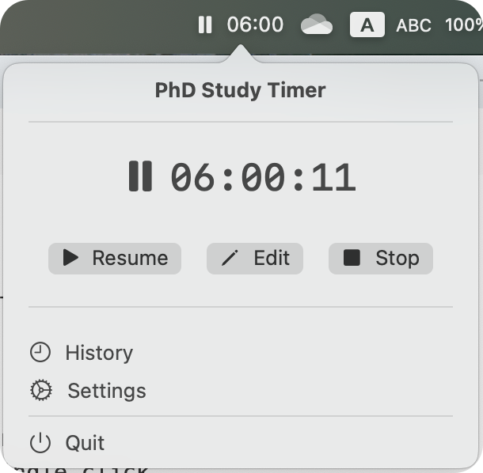
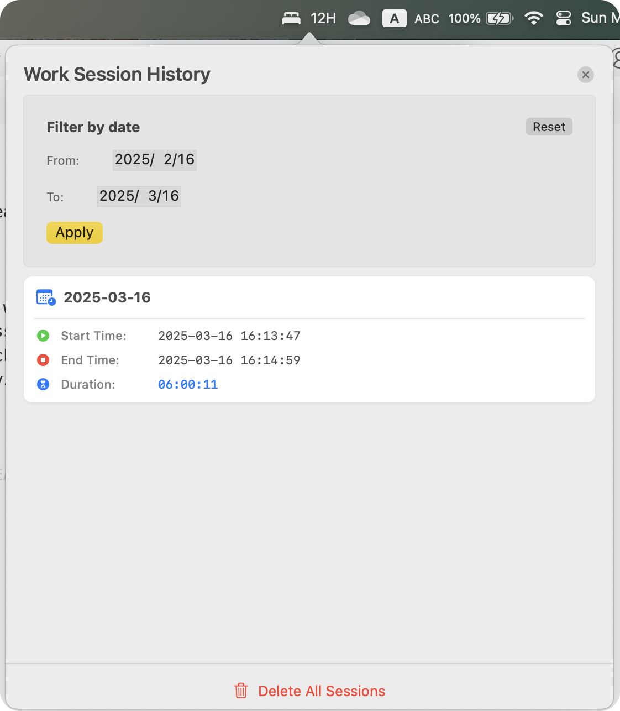

# PhD Study Timer

A macOS menu bar application designed to help PhD students and researchers track their work time efficiently.

Only a toy project for fun.

## Features

- **Menu Bar Integration**: Runs as a menu bar app for easy access without cluttering your desktop
- **Work Session Tracking**: Start, pause, resume, and end work sessions with a single click
- **Automatic Pause**: Automatically pauses when your screen is locked
- **Session History**: Records all your work sessions for later review

## Icon

https://macosicons.com/#/

## Screenshots

